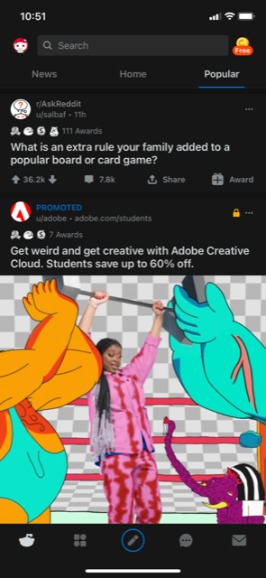
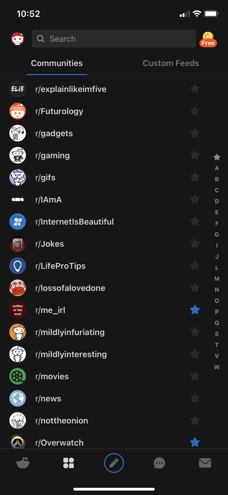
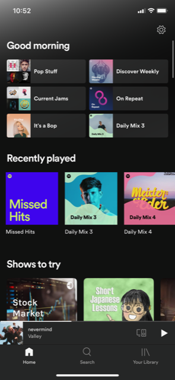
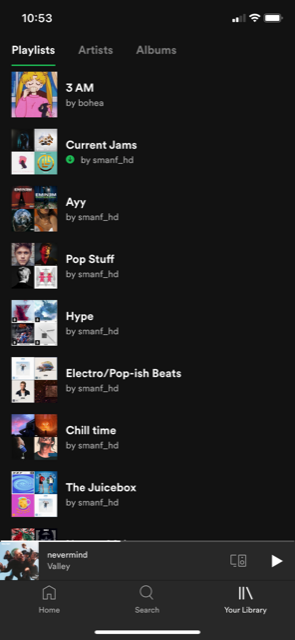

# DGL114-Process-Portfolio
## By Trevor Jacob
A Process Portfolio for DGL 114, Intro to Mobile App Development

### Week 1
**Activity 0101**  

I consider **Reddit's** mobile interface to be good because it keeps it simple but not to the point where it's hard to do anything. The two most commonly used buttons are on the bottom left that show your feeds, and what communities that you're following so you can quickly go to any community you want and view posts made on there.

I consider **Spotify's** app to be more difficult to use, mostly due to the fact that the home page feels cluttered. It also doesn't help that the library page shows icons for the playlists, meaning less can fit on one page requiring you to scroll down to find playlists that are on the bottom.

**Activity 0102** 
- Usable
  - Content on the home page
  - Useful buttons
  - Clear divide between what is the home and what is extra/side content
- Intuitive
  - House/Logo will always take you to the home/main page of the app
  - Useful icons that don't require the user to read the text under it
  - Content is where you'd expect it to be. No settings/extra content on the main page for example

### Week 2
**Activity 0202: Reddit**  

- Model
  - Subreddit icons/names
  - User's icon at the top left
  - Upvote/Downvote icons clicked yes/no
- View
  - Subreddit icons/names again as you can also click on them
  - The 5 icons at the bottom
  - Profile icon at the top left
  - Coins icon at the top right
- Controller
  - Upvote/Downvote icons
  - Comments, Share and the Award buttons

**Activity 0203**  
The Material.io article on [Iconography](https://material.io/design/iconography/product-icons.html) breaks down the "proper" way to design icons for one's brand. It gives a super basic breakdown of how to think about designing an icon, from what the material is made of, to how it interacts with a lighscource. Terminology relevant to the process is also covered and shown with examples, like *Finish, Material background and foreground, Colour and Shadows.* It also covers the do's and don'ts of icon design, though it does make you think about it, or at least brings it to your attention as to why you think something looks good. If you were to follow all of the do's presented on this page though, the icon you'd make would look very similar to everything Google has made and used for their icons.

### Week 3
**Activity 0301: Reddit**  
- Posts
  - "My Profile"
  - "Saved" -> comments/posts tabs
  - History
  - Pending
  - Drafts
  - Main page
  - Communities/Custom Feeds page
  - Chats page
- Making Money
  - Reddit Coins
  - Reddit Premium
  - Advertisement posts (click on them and it opens a new screen)
- Settings
  - Inbox
  - Settings menu (it's full screen popup)
  - Avatar Creation

**Activity 0302: Spotify**  
- onTouch
  - Selecting Menus
  - Selecting Songs
  - Pause/Song controls
  - Scrolling
  - Navigating Menus
- onDrag
  - Unused
- onLongClick
  - From what I can tell this isn't used, surprisingly
- onFocusChange
  - When inputting searches for songs/artists
  - When clicking on albums/playlists
- Other?
  - I know when spotify knows it's connected to a car's bluetooth it displays a huge version of the song control menu.

### Week 4
**Activity 0401: Spotify**  
The app from what I can tell is relatively flat, but not completely so. The main 3 pages for the app are Home, Search, and Your Library. The home page also has a settings button in the top right bringing you to the settings area. The search only has a camera option for scanning codes, and the Your Library page has 3 tabs, Playlists Artists and Albums. Also, this page has a podcasts page with 3 more tabs, Episodes, Downloads, Shows. There's no real central page from where every other page is accessed, instead that function is tied to the bottom bar.

**Activity 0403**  
The bottom app bar on a phone is mostly for navigation, but can have other options on it though google suggests no more than 4. When it comes to a Floating Action Button (FAB) they can be either above it layer wise, or inset (taking a chunk out of the bar) but shouldn't be placed physically above the bar as it makes it too hard to comfortably reach. They also suggest avoiding app navigation on the bar, specifically the home button/arrow for example, that should be on the top bar instead. Having a bottom bar doesn't mean you can't also have a top, though they shouldn't share any function (don't place a navigation menu on both top **and** bottom for example).

### Week 5 
**Activity 0502: Spotify**  
- Touch events
  - ACTION_DOWN for getting that "feel" of hitting a button. Songs and playlists shrink a little when tapped
  - ACTION_MOVE for scrolling through lists, whether that being song lists or your library of playlists
  - ACTION_UP I believe this is what actually gets used for tapping buttons and other objects, activating them
- Touch gestures
  - Tap. For hitting buttons
  - Scroll. For scrolling through lists
  - Drag. for re-arranging the song queue 
  - Fling. Scrolls through almost the entire playlist without you needing to continue to scroll through

**Activity 0503**  
Material.io's article on [Dialogs](https://material.io/components/dialogs) essentially says that dialogs are important, but since they completely stop the flow of the app, they shouldn't be overused. Also mentioned in the article is *how* to make a dialog box that is easy to use and understand. Things such as "choose a good title" and how to place the accept/deny buttons are brought up. The general idea being, don't assume the user knows exactly what each and every button does. So make sure that the deny button for an email for example, says discard instead of "Discard? -> yes." More detailed information on **when** to use them is also brought up, with other notifications that don't *need* user input being better suited to a banner or snackbar popup.
### Week 8
**Activity 0801: Spotify** 
- Shared Preferences: Spotify may use this when it comes to explicit songs. Though I know Reddit uses it when selecting dark theme or not.
- App-specific Files: Spotify can store what your profile photo is without you needing to tell it on an app by app basis, for example my photo is from my pc but I can see it on my phone.
- Shared Storage: Spotify may use this when you download a song? If not Spotify, I'd imagine Reddit uses it when you download or share something from the app.
- Database: Maybe Spotify uses this to remember what you were listening to and where you were in the song?
- Cloud: Spotify can use this to remember what song you were listening to across devices.

**Activity 0803**  
According to Material.io's article on [Lists](https://material.io/components/lists), the To-do list app does meet the expectations for lists. It's not perfect, it could be better if it had better markings/spacing between list entries but it's not bad. They say a list is easier to read if it has visuals to go along with it, but they're not strictly needed. The list also stays consistent, so for example it doesn't go from entry 1 to entry 6, and the sizing stays the same.

### Week 9
**Activity 0902**  
Based on what I've read in the [Fragments](https://developer.android.com/guide/fragments) page on the android site, it seems Fragments are kinda like mini activities that are in an app. So in the example they give, a navigation UI is shown, but the main content of the app is actually a fragment. It also seems like Fragments are meant to be more modular so you can use them in different places around the app. According to the [Creating a Fragment](https://developer.android.com/guide/fragments/create) page, you'll need to use the AndroidX Fragment library and the Maven repository, using build.gradle. You'd then create the fragment in it's own activity usually, with it's own class. You could then use it by adding it with XML or programmatically though using the ladder it's not automatically inserted.

**Activity 0903**  
The cards in Study helper aren't that bad, but still have room for improvement according to [Material Design's Card](https://material.io/components/cards#behavior) page. Adding a shadow can help the design feel more finished and make the card slightly easier to see. The cards could also have more info on them and then have different touch areas that will respond differently.
### Week 10
**Activity 1002** 
- You'll want to know *where* the notification is going to be, meaning where it's going to show up (on the lock screen, as a little dot above the app icon etc).
- Whether or not it has an action such as reply/ignore could also be something you consider.
- You can also set the notification to expand so more information is shown to the user.
- You'll also want to know what the importance of it is, which affects how the user is alerted and how it interacts with Do Not Disturb mode. 

**Activity 1003** 
Info taken from [Material IO's page on notifications](https://material.io/design/platform-guidance/android-notifications.html)
- You'll want to be careful to not spam the user with things that shouldn't be a notification, such as a "rate us now!" popup
  - Just a thought, This happens **a lot** with apps so it's surprising to find it here under the don't section
- Generally speaking, if the notification involves a person, the icon of the person goes on the left (though on the site it says the **right** side, the image shows it on the left). Details about the notification should go at the top, while the main content such as who sent it and what it says should go on the lower section. If an action is required it goes even after the main content section, sitting on the bottom.
- A user should be able to swipe the notification away so that it's not in the way, *unless* it needs to be there, such as a music tab. A user can also tap on an indicator to see an expanded view of it where more info is shown. If a user taps on it but *not* on the indicator, they should be taken to the screen that relates to the notification.

### Week 11
**Activity 1101** 
| Animation Type  | Definition |
| ------------- | ------------- |
| Frame-by-frame  | Shows one frame of an image after eachother, so think like a movie   |
| Tween  | Just changes the image to show animation, like rotations, moving it around, making it bigger or smaller etc  |
| Animation Drawable  | Uses **AnimationDrawable** to produce a frame-by-frame animation  |
| View Animation  | Uses **android.view.animation** to produce tween animations  |
| Property Animation  | Changes something (some property) of an object over time using android.animation uses a **time interpolator**  |
| Value Animator  | Creates a property animation by calculating values over time  |
| Object Animator  | Subclass of ValueAnimator, allows object's properties to be animated without **AnimatorUpdateListener**  |
| Animator Set  | Used to play multiple animations at the same time, one after the other, or on a delay  |

**Activity 1103** 
Info taken from [Material IO's page on notifications](https://material.io/design/motion/understanding-motion.html) 
Motion can help inform users focus on what's important to the app, if used right. It can also help explain how certain elements interact with eachother through the use of Hierarchy. For example, if you select an item in a shop app and it goes into the bottom right corner, the user now sees a shopping cart icon there, informing them of the purpose of that icon. All of this is ignoring the use of animation to further your brand identity, so you can create clean playful icons to show that your brand is friendly and easy to use for example. Or even transition around the app in a unique way if your brand is trying to feel more refined. Animation can also be used on icons, as shown in [Material IO's page on Animated Icons](https://material.io/design/iconography/animated-icons.html). Using animation in this way can make the user enjoy the app more as it feels more polished and maybe more playful. It also helps the user better understand what is about to happen, such as a clock ringing for an alarm.