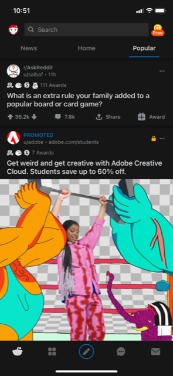
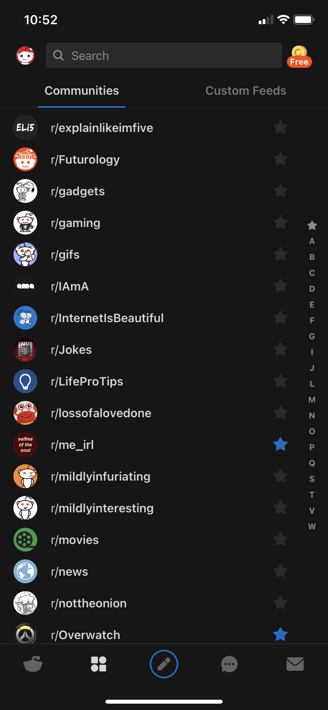
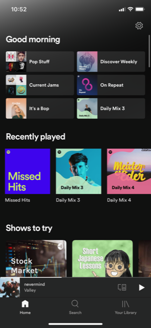
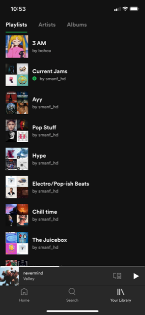

# DGL114-Process-Portfolio
## By Trevor Jacob
A Process Portfolio for DGL 114, Intro to Mobile App Development

### Week 1
**Activity 0101**

I consider Reddit's mobile interface to be good because it keeps it simple but not to the point where it's hard to do anything. The two most commonly used buttons are on the bottom left that show your feeds, and what communities that you're following so you can quickly go to any community you want and view posts made on there.

I consider Spotify's app to be more difficult to use, 